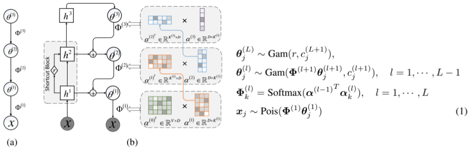

# SawETM: Sawtooth Factorial Topic Embeddings Guided Gamma Belief Network

This is the Pytorch implementation of the paper [Sawtooth Factorial Topic Embeddings Guided Gamma Belief Network](http://proceedings.mlr.press/v139/duan21b/duan21b.pdf)
in ICML2021.

This repo is created for more flexible application of SawETM. The original repository for SawETM is available in 
[BoChenGroup/SawETM](https://github.com/BoChenGroup/SawETM).




SawETM is a deep generative model of documents that captures the dependencies and semantic similarities between the topics and 
in the embedding space. Specifically, both the words and topics are represented as embedding vectors of
the same dimension. The topic matrix at a layer is factorized into the product of a factor loading
matrix and a topic embedding matrix, the transpose of which is set as the factor loading matrix of the layer above. Repeating this particular type of
factorization, which shares components between adjacent layers, leads to a structure referred to as sawtooth factorization. An auto-encoding variational inference network is constructed to optimize the model parameter via stochastic gradient
descent. 

## Key features

- We have reorganized and rewritten the implement of [SAWtooth_layer.py](https://github.com/wds2014/SawETM/blob/main/model.py#L22), making it more flexible 
to apply the latent topic representation to other tasks, such as image caption, nature language process.
- We also provide a wide-used text corpus `20ng_2000.pkl` for easy getting started. One can customize their own data based on this file.

### Three examples
- `main.py`, an usual hierarchical topic model.
- `main_ppl.py`, an hierarchical topic model with ppl test.
- `main_clc.py`, an hierarchical topic model with document classification and clustering tasks.


## Citation
If you find this repo useful to your project, please consider to cite it with following bib:

```bash
@inproceedings{duan2021sawtooth,
  title={Sawtooth factorial topic embeddings guided gamma belief network},
  author={Duan, Zhibin and Wang, Dongsheng and Chen, Bo and Wang, Chaojie and Chen, Wenchao and Li, Yewen and Ren, Jie and Zhou, Mingyuan},
  booktitle={International Conference on Machine Learning},
  pages={2903--2913},
  year={2021},
  organization={PMLR}
}
```

